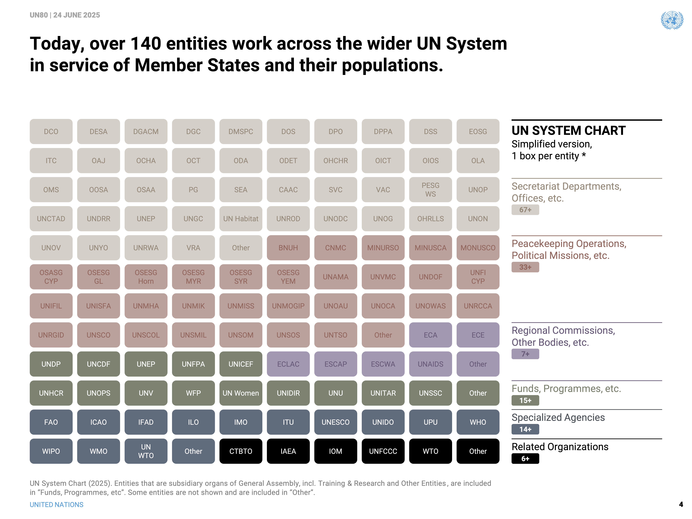

# un-system-chart-navigator

## Resources

- https://www.un.org/en/delegate/page/un-system-chart
- https://www.un.org/two-zero/sites/default/files/2025-06/un80_ms-brief_20250624_4.1.pdf

## Idea

Goal: http://system.un.org/

## TODO

- [ ] add next.js boilerplate, shadcn, tailwinds (-> create UN Website Starter)
- [ ] use color pallette and styling from slides
- [ ] try to quickly recreate this slide in interactive 
- [ ] 
