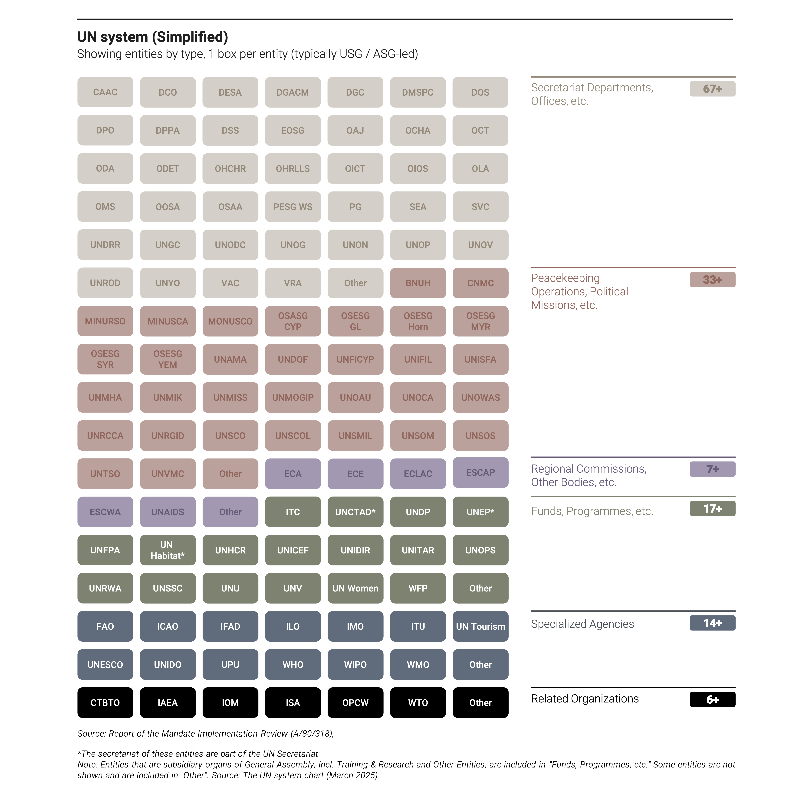

# [systemchart.un.org](https://systemchart.un.org)

## Resources

- https://www.un.org/en/delegate/page/un-system-chart
- https://www.un.org/un80-initiative/en/shifting-paradigms-1

## Idea

> Make the UN System interactively discoverable and navigate to all available resources.



## Dev & Deploy

1. **Install Dependencies**  
   Run the following command to install all required dependencies:

   ```bash
   npm install
   ```

2. **Run Development Server**  
   Start the development server with:

   ```bash
   npm run dev
   ```

   The application will be available at `http://localhost:3000`.

3. **Build for Production**  
   To create a production build, use:
   ```bash
   npm run build
   ```

## Data

- fetching from Airtable API
- minimal data wrangling in Python, export to JSON

To quickly refresh the data:

```shell
bash python/update_data.sh
```

## GitHub Actions

- Daily data fetch
- Continous deploy

## Maintenance

- `npx shadcn --version`
- `npx next --version`
- `npx shadcn@latest diff`

- `npm run lint`
- `npx eslint . --ext .js,.jsx,.ts,.tsx`
- `npx tsc --noEmit`

- `npm run format`
